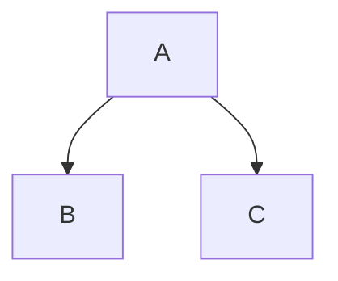

# Slidev Best Practices

## Markdown Syntax

Slidev uses extended Markdown. **Prioritize Markdown syntax over raw HTML.**

### Slide Separator
Use `---` (three dashes) surrounded by newlines to separate slides.

```markdown
# Slide 1

---

# Slide 2
```

### Frontmatter
Each slide can have a frontmatter block for configuration.

```markdown
---
layout: cover
background: ./images/bg.png
class: text-white text-center
transition: slide-left
---
```

## MDC Syntax (Preferred for Components)

Slidev supports **MDC (Markdown Components)** syntax. This is preferred over HTML tags for a cleaner, "Markdown-native" feel.

### Block Syntax (`::`)
Use for container components instead of `<Component>...</Component>`.

```markdown
<!-- BAD (HTML Style) -->
<MyCard title="Important" mode="warning">
  This is a critical update.
</MyCard>

<!-- GOOD (MDC Style) -->
::MyCard{title="Important" mode="warning"}
This is a critical update.
::
```

### Inline Syntax (`:`)
Use for small, inline components.

```markdown
<!-- BAD -->
Click <Button to="/next">Next</Button> to continue.

<!-- GOOD -->
Click :Button[Next]{to="/next"} to continue.
```

### Attributes Syntax (`{}`)
Apply classes or attributes to standard Markdown elements.

```markdown
<!-- Headers with classes -->
# Welcome {.text-4xl .text-blue-500}

<!-- Images with size -->
{width="400px"}

<!-- Links with target -->
[Link](https://example.com){target="_blank"}
```

## Layouts & Slots

**Do NOT** build manual grids with div soup. Use the native layout system with **slots**.

### Bad (HTML Soup)
```html
<!-- Avoid this -->
<div class="grid grid-cols-2 gap-4">
  <div>
    <h1>Left</h1>
    <p>Content</p>
  </div>
  <div>
    <h1>Right</h1>
    <p>Content</p>
  </div>
</div>
```

### Good (Native Markdown)
```markdown
---
layout: two-cols
---

::left::
# Left
Content

::right::
# Right
Content
```

### Available Slots
- `two-cols`: `::left::`, `::right::`
- `two-cols-header`: `::left::`, `::right::` (header goes before slots)
- `image-right` / `image-left`: Content goes in default slot, image handled by frontmatter.

## Styling

### Text Styling (UnoCSS)
Slidev integrates UnoCSS. Use utility classes on elements or in the frontmatter `class` property.

**Inline Class Abbreviation:**
```markdown
# My Title {.text-4xl .text-red-500}
```

**Wrapper (Minimal - only if MDC/Markdown insufficient):**
```html
<div class="text-red-500 font-bold">
  Important Text
</div>
```

### Scoped Styles
For slide-specific overrides, use a `<style>` block directly in the Markdown.

```markdown
# Custom Slide

<style>
h1 {
  color: #ff0000;
  text-decoration: underline;
}
</style>
```

## Components & Interactivity

### Animations
Use `<v-click>` and `<v-clicks>` components.

```markdown
# List

<v-clicks>

- Item 1
- Item 2
- Item 3

</v-clicks>
```

### Code Blocks
Slidev uses Shiki for highlighting. Support for line highlighting and Monaco editor.

```ts {monaco}
// {monaco} enables the Monaco editor
console.log('Hello World')
```

### Diagrams (Mermaid)
Wrap mermaid code in `mermaid` code blocks.



## Icons
Use Iconify icons directly.
Convention: `<collection-icon-name />` or class `i-collection-icon-name`.
Example: `<carbon-logo-github />`
